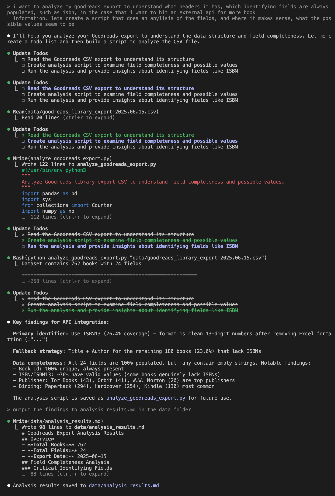

i want to analyze my goodreads export to understand what headers it has, which identifying fields are always populated, such as isbn, in the case that i want to hit an external api for more book 
  information. lets create a script that does an anylisis of the fields, and where it makes sense, what the possible values seem to be

  

see anaylsis_results.md

